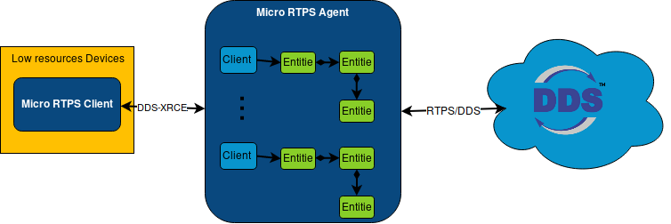

# Micro RTPS Agent

*Micro RTPS Agent* acts as a server between DDS Network and *Micro RTPS Clients*. *Micro RTPS Agents* receive messages containing Operations from Clients. Agents keep track of the Clients and the *Micro RTPS Entities* they create. The Agent uses the Entities to interact with DDS Global Data Space on behalf of the Client.

The communication between a *Micro RTPS Client* and a *Micro RTPS Agent* supports two kind transports: UDP or SerialPort. While running *Micro RTPS Agent* will attend any received request from your *Micro RTPS Clients*. *Micro RTPS Agent* answers back with the result of a request each time a request is attended.

## Documentation

You can access Micro-RTPS documentation online, which is hosted on Read the Docs.

* [Start Page](http://micro-rtps.readthedocs.io)
* [Installation manual](http://micro-rtps.readthedocs.io/en/latest/installation.html)
* [User manual](http://micro-rtps.readthedocs.io/en/latest/introduction.html)

## Dockerfile

There is a *Micro RTPS Agent* Dockerfile available on [Docker Hub](https://hub.docker.com/r/eprosima/micrortps/).

## Getting Help

If you need support you can reach us by mail at `support@eProsima.com` or by phone at `+34 91 804 34 48`.
